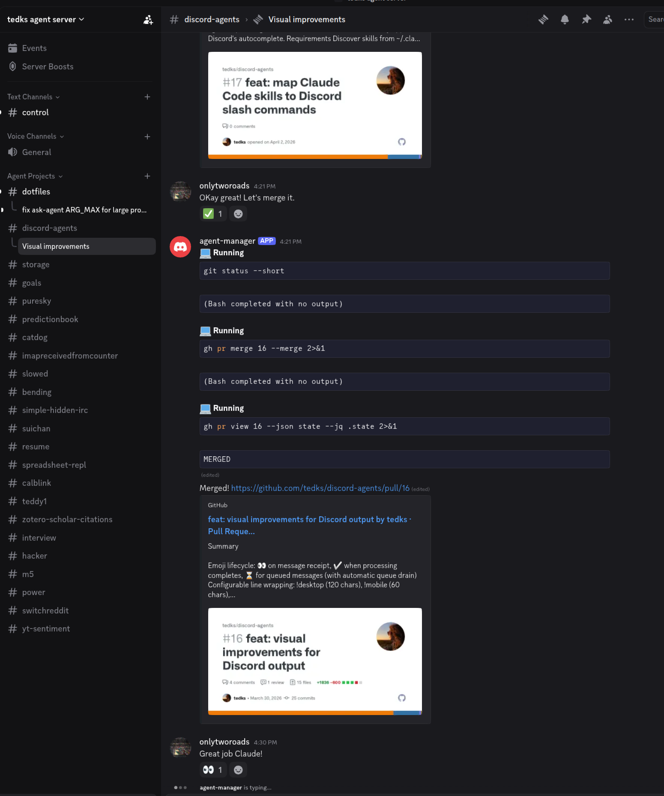

# discord-agents

discord-agents is a Discord server interface for coding agents. Every channel is a project, and every agent session is a thread. Channels are connected to their own management agent sessions that can spawn new threads conversationally. You can drop in your existing projects or resume the sessions that are already on your machine. New sessions automatically get their own worktrees.

There is a `!command` interface to server management, and control channels also have access to an MCP for session and project operations, including changing the default agent and stopping active sessions. Session-level overrides inside a channel remain command-driven via `!session-agent`.

discord-agents is intended to be a simple interface to agentic coding on your personal machines and is not intended to be used in shared Discord servers. There is no authentication, and it has the full capabilities of a coding agent launched as the user you started it as. There is no sandboxing in discord-agents itself; use Unix and Claude sandboxing if you require it.

Only tested on GNU+Linux. Environment managed by Nix. Built with OCaml 5.3.



## Quickstart

```bash
# Build
nix develop --command dune build

# Configure
mkdir -p ~/.config/discord-agents
cat > ~/.config/discord-agents/config.json << 'EOF'
{
  "discord_token": "your-bot-token",
  "guild_id": "your-server-id",
  "base_directories": ["~/Projects"]
}
EOF

# Run
nix develop --command dune exec discord-agents
```

Then in Discord:

```
!projects              # see what it found
!start myproject       # start a session (fuzzy-matches)
```

Or just chat in any project channel -- the agent will respond directly.

See [SETUP.md](SETUP.md) for detailed installation and Discord bot setup instructions.

`config.json` is validated at startup. The required fields are
`discord_token` (or `DISCORD_BOT_TOKEN`) and `guild_id`; optional
fields default to `base_directories: []`, `control_channel_id: null`,
and `projects: []`. The older `base_dirs` key is still accepted as an
alias, but new configs should use `base_directories`. See
[`config.example.json`](config.example.json).

## Commands

All commands use a `!` prefix:

| Command | Description |
|---------|-------------|
| `!start <project> [agent]` | Start a session with the current effective top-level agent or explicit agent |
| `!default-agent [agent]` | Show or set the default agent (`claude`, `codex`, `gemini`) |
| `!rescue-agent [agent|off]` | Show, set, or disable the rescue agent used at warning-level disk pressure |
| `!session-agent [agent]` | Show or set the current channel's session agent |
| `!start` | Show numbered project list |
| `!resume [agent] <session_id>` | Resume an existing session |
| `!projects` | List discovered projects |
| `!sessions` | List active bot sessions |
| `!claude-sessions` | List recent Claude Code sessions on this machine |
| `!stop <thread_id>` | Stop a session |
| `!rename [thread_id] <name>` | Rename a thread |
| `!desktop` | Set line wrapping to desktop width (120 chars) |
| `!mobile` | Set line wrapping to mobile width (60 chars) |
| `!wrapping [n]` | Show or set line wrap width |
| `!status` | Bot status and running processes |
| `!cleanup` | Delete stale project channels |
| `!restart` | Rebuild and restart the bot |
| `!help` | Command reference |

All channels -- control and project -- have the same capabilities. The agent knows which channel it's in and has context about the associated project. Non-command messages are routed to the channel's current session automatically; new top-level channel sessions start with the current effective top-level agent. Normally that is the default agent, but if you configure a rescue agent and warning-level disk pressure is active, the rescue agent takes over automatically unless you set a `!session-agent` override on that session. Read-only disk mode still blocks new stateful session creation until space is freed.

`!default_agent`, `!rescue_agent`, and `!session_agent` are accepted as underscore aliases.

Changing an agent starts a fresh backend session for that channel. It does not migrate conversation state between Claude, Codex, and Gemini.

File attachments (screenshots, code, logs, PDFs, etc.) are downloaded and passed to the agent, which can read them directly.

## Testing

```bash
nix develop --command dune runtest
```

## License

[GNU Affero General Public License v3.0](LICENSE)
